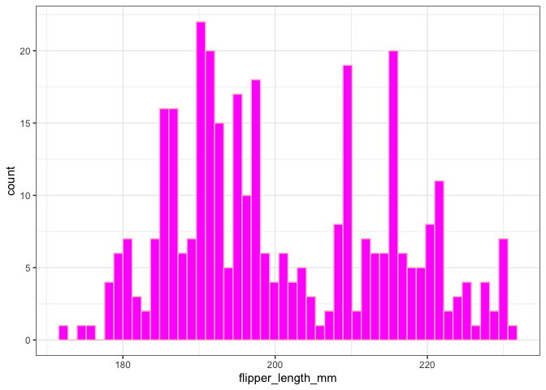

# STAT 545 Assignment B1

Brian Deng 60169810

## Loading libraries & data

    library(tidyverse)

    ## ── Attaching core tidyverse packages ──────────────────────── tidyverse 2.0.0 ──
    ## ✔ dplyr     1.1.4     ✔ readr     2.1.5
    ## ✔ forcats   1.0.0     ✔ stringr   1.5.1
    ## ✔ ggplot2   3.5.2     ✔ tibble    3.3.0
    ## ✔ lubridate 1.9.4     ✔ tidyr     1.3.1
    ## ✔ purrr     1.0.4     
    ## ── Conflicts ────────────────────────────────────────── tidyverse_conflicts() ──
    ## ✖ dplyr::filter() masks stats::filter()
    ## ✖ dplyr::lag()    masks stats::lag()
    ## ℹ Use the conflicted package (<http://conflicted.r-lib.org/>) to force all conflicts to become errors

    library(roxygen2)
    library(testthat)

    ## 
    ## Attaching package: 'testthat'
    ## 
    ## The following object is masked from 'package:dplyr':
    ## 
    ##     matches
    ## 
    ## The following object is masked from 'package:purrr':
    ## 
    ##     is_null
    ## 
    ## The following objects are masked from 'package:readr':
    ## 
    ##     edition_get, local_edition
    ## 
    ## The following object is masked from 'package:tidyr':
    ## 
    ##     matches

    library(datateachr)
    library(palmerpenguins)
    library(gapminder)

# Exercise 1 & 2: Making and Documenting the Function

During my mini data analysis project, I coded quite a few histograms. I
want to create a function that takes in data inputs and outputs a
histogram. This way, I don’t need to type out the histogram code each
time I want a histogram. I like magenta so the function will plot a
histogram with magenta coloured bars.

    #' Plot a histogram with magenta bars of a numeric variable
    #' 
    #' This function plots a simple histogram using ggplot2 with magenta coloured bars. 
    #' The user inputs the data frame, column name, bin number.
    #'
    #' @param data The data frame that contains the variable of interest. Mandatory.
    #' @param variable The variable of interest, which must be numerical. Mandatory. 
    #' @param bins The number of bins for the histogram, which must be a positive integer. Mandatory. 
    #'
    #' @return A histogram plot with the variable of interest as the x axis. 
    #' @examples
    #' plot_magenta_histogram(cancer_sample, concavity_mean, 50)
    #' plot_magenta_histogram(cancer_sample, radius_mean, 100)
    #' plot_magenta_histogram(penguins, bill_length_mm, 50)
    #' plot_magenta_histogram(gapminder, lifeExp, 100)
    #'
    #' @export

    plot_magenta_histogram <- function(data, variable, bins) {

      # check data frame input
      if (!is.data.frame(data)) {
        stop("The input data frame must be a data frame.")
      }
      
      # dropping rows that contain NA's
      data <- filter(data, !is.na({{ variable }}))
      
      # check numeric variable input after filtering
      if (nrow(data) == 0) {
        stop("The input variable does not contain data after filtering")
      }

      # check numeric variable input
      if (!is.numeric(pull(data, {{ variable }}))) {
        stop("The input variable must be a numeric variable.")
      }
      
      # check bin input
      if (!is.numeric(bins) | bins <= 0 ) {
        stop("The input bins must be a positive integer")
      }
      
      # dropping rows that contain NA's
      data <- filter(data, !is.na({{ variable }}))
      
      # plotting histogram
      ggplot(data, aes(x = {{ variable }})) +
          geom_histogram(bins = bins, fill = "magenta", colour = "pink") +
          theme_bw()
    }

# Exercise 3: Examples

I’m now going to provide some examples using various datasets.

Plotting the distribution of average radius of tumour samples

    # the cancer_sample dataset has columns of numerical variables 
    plot_magenta_histogram(cancer_sample, radius_mean, 50)

Example of common errors with this code

    # mistyping the variable name will simply return an error
    plot_magenta_histogram(cancer_sample, raduis_maen)

    ## Error in `filter()`:
    ## ℹ In argument: `!is.na(raduis_maen)`.
    ## Caused by error:
    ## ! object 'raduis_maen' not found

    # forgetting to specify the number of bins
    plot_magenta_histogram(cancer_sample, concavity_mean)

    ## Error in plot_magenta_histogram(cancer_sample, concavity_mean): argument "bins" is missing, with no default

    # putting a negative integer as the number of bins
    plot_magenta_histogram(cancer_sample, concavity_mean, -1)

    ## Error in plot_magenta_histogram(cancer_sample, concavity_mean, -1): The input bins must be a positive integer

    # putting a non-integer as the number of bins 
    plot_magenta_histogram(cancer_sample, concavity_mean, "50")

    ## Error in plot_magenta_histogram(cancer_sample, concavity_mean, "50"): The input bins must be a positive integer

    # inputting a non-data frame 
    plot_magenta_histogram(cancer_sample$diagnosis, concavity_mean)

    ## Error in plot_magenta_histogram(cancer_sample$diagnosis, concavity_mean): The input data frame must be a data frame.

    # inputting a non-numerical variable 
    plot_magenta_histogram(cancer_sample, diagnosis)

    ## Error in plot_magenta_histogram(cancer_sample, diagnosis): The input variable must be a numeric variable.

Examples of the code with another dataset

    # plotting the penguin bill length distribution in all penguins
    plot_magenta_histogram(gapminder, gdpPercap, 100)

    # plotting the life expectancy from countries around the world
    plot_magenta_histogram(gapminder, lifeExp, 100)

Example of variable that contains a lot of NA’s

    # all columns some NA's in the column 
    glimpse(penguins)

    ## Rows: 344
    ## Columns: 8
    ## $ species           <fct> Adelie, Adelie, Adelie, Adelie, Adelie, Adelie, Adel…
    ## $ island            <fct> Torgersen, Torgersen, Torgersen, Torgersen, Torgerse…
    ## $ bill_length_mm    <dbl> 39.1, 39.5, 40.3, NA, 36.7, 39.3, 38.9, 39.2, 34.1, …
    ## $ bill_depth_mm     <dbl> 18.7, 17.4, 18.0, NA, 19.3, 20.6, 17.8, 19.6, 18.1, …
    ## $ flipper_length_mm <int> 181, 186, 195, NA, 193, 190, 181, 195, 193, 190, 186…
    ## $ body_mass_g       <int> 3750, 3800, 3250, NA, 3450, 3650, 3625, 4675, 3475, …
    ## $ sex               <fct> male, female, female, NA, female, male, female, male…
    ## $ year              <int> 2007, 2007, 2007, 2007, 2007, 2007, 2007, 2007, 2007…

    # in all the plots below, the NA's are dropped and do not show up in the histogram
    plot_magenta_histogram(penguins, bill_length_mm, 50)

    plot_magenta_histogram(penguins, bill_depth_mm, 50)

    plot_magenta_histogram(penguins, flipper_length_mm, 50)

    plot_magenta_histogram(penguins, body_mass_g, 50)

# Exercise 4: Testing the Function

Before we start, I’m going to create data frames to run tests from

    # a data frame with multiple columns with various types of variables 
    test_data <- data.frame(
      diagnosis = c("M", "M", "M", "B", "B", "B"), 
      radius = c(100, 101, 95, 34, 56, 21),
      radius_non_numerical = c("100", "101", "95", "34", "56", "21"),
      radius_NA = c(100, 101, 95, 34, NA, 21)
    )

    # a data frame with no data
    test_data_zero <- data.frame(
      zero = numeric(0)
    )

    # a data frame with NA data
    test_data_NA <- data.frame(
      NAs = c(NA, NA, NA, NA)
    )

Test that the function will not take in a non-numeric variable

    # the diagnosis column contains non-numerical values
    test_that("Function will error because a non-numeric variable was inputted", {
      expect_error(plot_magenta_histogram(test_data, diagnosis, 100))
    })

    ## Test passed 🎉

    # the radius_non_numerical column also contains non-numerical values
    test_that("Function will error because a non-numeric variable was inputted", {
      expect_error(plot_magenta_histogram(test_data, radius_non_numerical, 100))
    })

    ## Test passed 🥳

Test that the function will not error if there are NA’s present

    # the NA values will be filtered out 
    test_that("Function will be able to handle NA values", {
      expect_no_error(plot_magenta_histogram(test_data, radius_NA, 100))
    })

    ## Test passed 🎉

Test that the function errors if there is nothing in the data frame

    # the data frame has no data in it
    test_that("Function will error when there is nothing in the data frame", {
      expect_error(plot_magenta_histogram(test_data_zero, zero, 100))
    })

    ## Test passed 🎊

    # since the data frame only has NA values, they will be filtered out and the data frame will no longer have data 
    test_that("Function will error when there is nothing in the data frame", {
      expect_error(plot_magenta_histogram(test_data_NA, NAs, 100))
    })

    ## Test passed 🥇

Test that a proper ggplot object is outputted

    test_that("ggplot structure is correct", {
      plot <- plot_magenta_histogram(penguins, bill_length_mm, 50)
      
      # check that the plot is a ggplot object
      expect_s3_class(plot, "ggplot")
      
      # check that the input variable is correctly mapped
      expect_equal(rlang::as_name(plot$mapping$x), "bill_length_mm")
     })

    ## Test passed 😸
